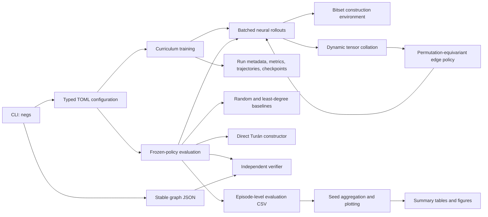

# Architecture

This guide explains how Neural Extremal Graph Search turns an empty graph into
a verified terminal graph, how the learned policy is trained, and where each
artifact comes from. It is intended to be the first document to read before
changing the code.

The MVP has one deliberate boundary: the construction environment and learned
policy support triangle-free graphs (`r = 2`). The Turán formulas, direct
constructor, and independent verifier support general `r`.

## System at a glance



The important separation is between **construction**, **learning**, and
**verification**. The environment prevents illegal actions efficiently, while
evaluation independently checks the final graph instead of trusting that fast
path.

## Package map

| Module | Responsibility |
| --- | --- |
| `cli.py` | Parses `train`, `evaluate`, `verify`, and `report`; imports heavier subsystems lazily. |
| `config.py` | Loads TOML into immutable dataclasses and validates the MVP contract. |
| `graph.py` | Defines canonical edges and immutable `GraphState`, `Transition`, and `Trajectory` values. |
| `turan.py` | Computes exact Turán partitions and edge bounds and constructs the oracle graph. |
| `env.py` | Owns the mutable graph-under-construction and optimized neighbourhood bitsets. |
| `verification.py` | Checks forbidden cliques and terminal maximality independently of the environment. |
| `serialization.py` | Reads and writes the versioned graph JSON schema. |
| `baselines.py` | Implements uniform-random and least-degree construction policies. |
| `features.py` | Converts variable-size graph states and legal edges into padded tensor batches. |
| `policy.py` | Implements dense message passing, symmetric edge scoring, masking, and sampling. |
| `rollouts.py` | Runs complete stochastic neural-policy episodes, batching all active graphs. |
| `training.py` | Collects rollouts, selects elites, optimizes the policy, validates stages, and saves artifacts. |
| `evaluation.py` | Runs frozen checkpoints and controls, independently verifies outputs, and writes episode rows. |
| `reporting.py` | Aggregates seed-level means and Student-t intervals and generates figures and tables. |
| `utils.py` | Centralizes seeding, device selection, environment metadata, and JSON/JSONL writing. |
| `__init__.py` | Defines the stable public import surface. |

## Core graph values and ownership

The project deliberately uses two graph representations.

### Mutable construction state

`GraphConstructionEnv` owns:

- a set of canonical edges;
- one Python integer bitset per vertex, where bit `v` means that `v` is a
  neighbour;
- a seeded `random.Random` instance for baseline tie-breaking.

For a missing edge `(u, v)`, triangle-free legality is exactly

```text
neighbour_mask[u] & neighbour_mask[v] == 0
```

The bitwise intersection answers the common-neighbour question without
constructing Python sets. Adding an edge updates two bitsets. The action is
monotone: edges are never removed.

### Immutable snapshots

`GraphState` is the boundary value passed to features, models, verifiers,
serialization, and saved trajectories. Its constructor:

- rejects self-loops and out-of-range endpoints;
- rewrites every edge to `(min(u, v), max(u, v))`;
- sorts edges and rejects duplicates.

`Transition` describes one legal step. `Trajectory` stores the pre-action
states, chosen actions, normalized rewards, final state, and final optimality
ratio. The lengths of `states`, `actions`, and `rewards` must agree.

## Mathematical contract

For the MVP environment:

1. `n >= 2` and `r == 2`.
2. Every action is a missing canonical edge.
3. An action is legal exactly when its endpoints have no common neighbour.
4. Every accepted action receives reward
   `1 / turan_edge_count(n, 2)`.
5. An episode terminates when no legal edge remains.

Consequently, the trajectory return is exactly

```text
final edge count / Turán edge count
```

and every terminal state should be a maximal triangle-free graph. Maximal does
not necessarily mean maximum: a maximal graph can have fewer edges than the
balanced complete bipartite optimum.

`turan_partition_sizes`, `turan_edge_count`, and `construct_turan` are valid for
general `r`. The direct constructor is an oracle used to check the exact bound;
it is not a search policy.

## Independent verification boundary

`verify_graph` is intentionally slower and simpler than the environment. It
enumerates vertex combinations and performs explicit edge-membership checks.
For a constraint-free graph it also tests every missing edge for addability.

Evaluation calls this verifier for every completed graph and refuses to finish
successfully if any row contains a forbidden clique or a non-maximal terminal
state. This separation protects the experiment from a shared implementation
error between action masking and reported validity.

Serialized graphs have the stable form:

```json
{
  "schema_version": 1,
  "n": 6,
  "r": 2,
  "edges": [[0, 3], [1, 4]]
}
```

Unknown fields, missing fields, malformed edges, and unsupported schema
versions are rejected.

## Tensor batching contract

`collate_graph_states` pads only to the largest graph and candidate set in the
current batch. Padding is not part of the model parameterization.

Let:

- `B` be the batch size;
- `N` be the maximum number of nodes in this batch;
- `C` be `max(1, maximum legal candidate count)`.

The `GraphTensorBatch` fields are:

| Field | Shape | Dtype | Meaning |
| --- | --- | --- | --- |
| `adjacency` | `[B, N, N]` | `float32` | Symmetric dense adjacency matrices. |
| `node_features` | `[B, N, 4]` | `float32` | Four permutation-equivariant node features. |
| `node_mask` | `[B, N]` | `bool` | Real nodes versus padding. |
| `candidates` | `[B, C, 2]` | `int64` | Endpoint indices for legal missing edges. |
| `candidate_features` | `[B, C, 5]` | `float32` | Five symmetric endpoint statistics. |
| `candidate_mask` | `[B, C]` | `bool` | Real candidates versus padding. |

The four node features are:

1. degree divided by `max(1, n - 1)`;
2. number of incident legal edges divided by the same scale;
3. current edge count divided by the Turán bound;
4. bounded constraint encoding `1 / r`.

The five candidate features are normalized degree sum, degree difference,
legal-incidence sum, legal-incidence difference, and common-neighbour count.
For legal triangle-free actions the common-neighbour feature is necessarily
zero; it remains in the v0.1 tensor contract as an explicit statistic and an
extension point for future constraint families.

No vertex identifier or explicit graph-size feature is present. Candidate
statistics are invariant to swapping the two endpoints.

## Neural policy

`EdgePolicy` has three conceptual stages:

1. **Input projection.** Each four-dimensional node feature vector is projected
   to the hidden width, followed by SiLU and LayerNorm.
2. **Message passing.** Each layer computes a mean of neighbour embeddings,
   combines it with the current embedding, applies a learned update, and adds a
   residual connection followed by LayerNorm. Node padding is zeroed after
   every layer.
3. **Symmetric edge scoring.** For candidate endpoints `u` and `v`, the scorer
   receives `h_u + h_v`, `abs(h_u - h_v)`, `h_u * h_v`, and the five candidate
   statistics. A small MLP produces one logit.

Illegal and padded candidate positions are replaced with negative infinity
before softmax. A terminal graph has an all-masked row; `sample_actions` returns
`-1` for that row and rollout code never attempts to step it.

At the empty graph, every node has the same features and structure. Therefore
all legal edges receive the same probability, as required by permutation
equivariance. Seeded stochastic sampling provides the initial symmetry break.

## Neural episode lifecycle

`run_episode_batch` creates one environment per episode seed and repeats:

1. collect the currently active immutable states;
2. enumerate legal edges for each state;
3. remove graphs that have terminated;
4. collate the remaining states into one dynamic padded batch;
5. run `EdgePolicy.forward` and sample one candidate per active row;
6. apply each sampled edge to its owning environment;
7. retain only environments that still have legal actions.

The model is temporarily put in evaluation mode and inference runs under
`torch.inference_mode()`. Sampling is performed with a seeded CPU
`torch.Generator`, including when model inference runs on MPS. The original
training/evaluation mode is restored afterward.

The single-episode `run_episode` function is a one-row wrapper around the batch
implementation, so both paths share identical semantics.

## Training lifecycle

The `train` command resolves TOML configuration and creates
`runs/<name>-seed-<seed>/`. One process trains exactly one seed.

For curriculum stage `k`:

1. all sizes through stage `k` are introduced;
2. the rollout budget is divided as evenly as possible across those sizes;
3. completed trajectories are grouped by size;
4. the top configured fraction is retained independently within each size;
5. every `(state, selected action)` pair from the elites becomes a supervised
   cross-entropy example;
6. AdamW performs the configured optimization passes with gradient clipping;
7. validation runs at the configured interval on every introduced size.

The current stage advances after its own validation ratio reaches the threshold
for the required number of consecutive validations. The stage also ends when
its iteration budget is exhausted, and the metrics record whether the gate was
actually passed. The best validation snapshot is selected by mean ratio across
all introduced sizes.

### Training artifacts

| Artifact | Purpose |
| --- | --- |
| `config.toml` | Fully resolved configuration, including a CLI seed override. |
| `metadata.json` | Commit, platform, Python, package versions, device, seed, and start time. |
| `metrics.jsonl` | Append-only iteration, validation, gate, and timing records. |
| `latest.pt` | Resumable model, optimizer, curriculum position, and selection RNG state. |
| `stage-n<N>.pt` | Best validation snapshot for one completed curriculum stage. |
| `best.pt` | Best snapshot from the latest completed stage; used for evaluation. |
| `sample_trajectories.jsonl` | Compact examples from the final elite set. |
| `completion.json` | Completion time, total steps, and best-checkpoint path. |

Release checkpoints are copied to `artifacts/checkpoints/`; transient run
directories remain ignored by Git.

## Evaluation and reporting

`evaluate` first maps requested seeds to checkpoints and requires the model
configuration in each checkpoint to match the evaluation TOML. It then runs
every configured method, size, seed, and episode:

- `gnn`: the frozen trained checkpoint for that seed;
- `untrained_gnn`: a deterministically initialized learning diagnostic;
- `random`: uniform legal-edge sampling;
- `least_degree`: minimum endpoint-degree sum with random tie-breaking;
- `turan_oracle`: direct construction of the known optimum.

Each episode becomes one CSV row containing the edge count, Turán bound,
optimality ratio, absolute gap, exact-optimum indicator, Turán-isomorphism
indicator, violations, terminal maximality, episode length, inference time, and
checkpoint path.

`report` first averages episode metrics within each `(method, n, seed)` group.
It then computes the mean and a 95% Student-t interval across seed-level values.
The final outputs are `summary.csv`, `summary.md`, the optimality-ratio figure,
the exact-success figure, and—when run metrics are available—the curriculum
curve.

## CLI call paths

The four stable commands follow these paths:

```text
negs train
  cli.main → load_training_config → training.train
  → run_episode_batch → collate_graph_states → EdgePolicy
  → elite selection → optimization → validation → checkpoints

negs evaluate
  cli.main → load_evaluation_config → evaluation.evaluate
  → checkpoints / baselines / oracle → verify_graph → evaluation.csv

negs verify
  cli.main → load_graph → verify_graph → JSON VerificationReport

negs report
  cli.main → reporting.generate_report
  → seed aggregation → confidence intervals → tables and figures
```

The CLI catches expected file, configuration, and runtime errors, writes a
short message to standard error, and returns a non-zero status. Verification
uses status `2` for a well-formed graph that fails the requested checks.

## Reproducibility design

Canonical runs use CPU and deterministic PyTorch operations. Separate seed
derivations are used for training rollouts, validation rollouts, and evaluation
episodes. Elite tie-breaking has its own saved Python RNG. The resumable
checkpoint contains the optimizer and curriculum position in addition to model
weights.

MPS is available for exploration, but the project does not claim bit-for-bit
MPS reproducibility. Model sampling still uses a CPU generator to keep the
sampling API consistent.

## Tests and trust boundaries

The test suite is organized by the failure boundary it protects:

- `test_environment.py` exhaustively compares bitset legality with brute force
  for every triangle-free graph through `n = 6`, then property-tests terminal
  validity and reward accounting;
- `test_turan.py` property-tests balanced partitions, formulas, construction,
  and general-`r` verification;
- `test_verification_serialization.py` tests independent failure reporting and
  the strict JSON schema;
- `test_policy.py` tests masks, finite probabilities, terminal sampling,
  permutation equivariance, dynamic padding, and seeded sampling;
- `test_rollouts_training.py` tests neural rollout reproducibility, checkpoint
  production, and resume behavior;
- `test_evaluation_reporting_cli.py` covers the full train/evaluate/report/verify
  command path with a tiny experiment.

CI runs Ruff linting, Ruff formatting checks, and the complete pytest suite on
every push and pull request.

## Recommended reading order

For a first code-reading session:

1. `graph.py`, `turan.py`, and `env.py` — understand the mathematical state
   machine;
2. `features.py` — see exactly what information reaches the model;
3. `policy.py` — follow one tensor batch through message passing and scoring;
4. `rollouts.py` — connect model probabilities back to environment actions;
5. `training.py` — follow one curriculum iteration and its artifacts;
6. `evaluation.py` and `reporting.py` — trace how a checkpoint becomes a paper
   result;
7. the corresponding test file after each subsystem.

## Change guide

Use these dependency paths when extending the project:

- **Add a node or candidate feature:** update `features.py`, `ModelConfig`, both
  experiment configurations, policy shape tests, and the checkpoint format or
  migration policy. Existing checkpoints will not be shape-compatible.
- **Add a baseline:** implement the policy in `baselines.py`, register its name
  in `config.py`, add evaluation dispatch in `evaluation.py`, and ensure plots
  give it a stable order.
- **Add an evaluation metric:** create it in `_row`, aggregate it in
  `reporting.py`, document the statistical unit, and add an end-to-end test.
- **Support `r = 3`:** generalize environment legality, feature construction,
  and action masking. The Turán utilities and independent verifier already
  support general `r`, but checkpoint and experiment schemas will need a clear
  compatibility decision.
- **Add a different model family:** preserve the candidate-mask contract and
  define how its configuration and state are identified in checkpoints before
  sharing the existing rollout and evaluation machinery.

The first planned `v0.2` experiment is a fixed-size MLP control. It should reuse
the same environment, episode seeds, evaluation rows, verification, and
reporting so the comparison isolates model architecture rather than changing
the experimental protocol.
