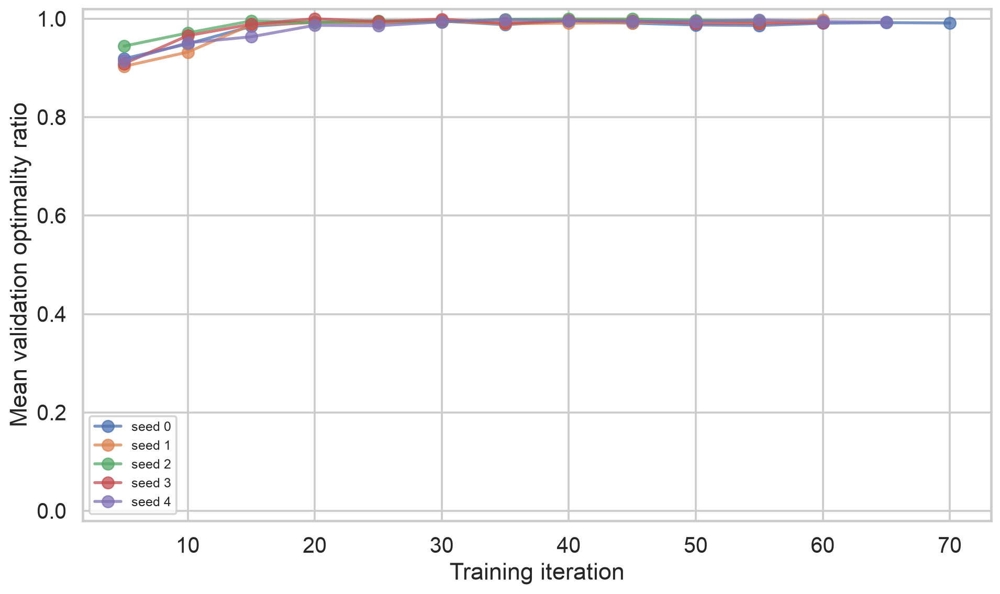
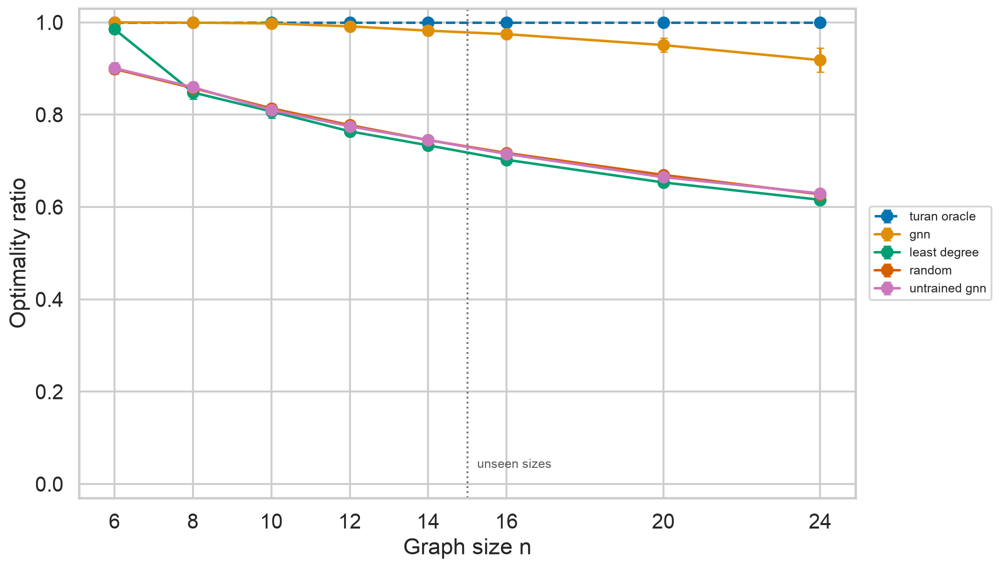
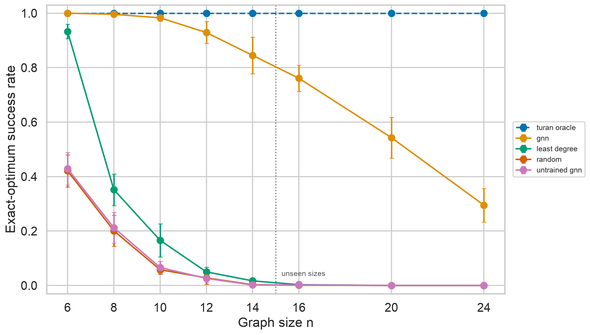

# Neural Extremal Graph Search

## Does a graph neural network learn a size-generalizable Turán construction?

**Final MVP report — 31 July 2026**

### Abstract

This project tests whether a permutation-equivariant graph neural network can
learn a construction strategy rather than memorize solutions at fixed graph
sizes. Starting from an empty graph, a policy repeatedly adds an edge subject
to a hard triangle-free constraint. Its objective is to maximize the final edge
count. Turán's theorem supplies an exact optimum for every graph size: the
balanced complete bipartite graph \(T_2(n)\).

The policy was trained by elite-trajectory cross-entropy on
\(n\in\{6,8,10,12,14\}\) and frozen before evaluation on unseen sizes
\(n\in\{16,20,24\}\). Five independent training seeds were compared with
uniform random construction, a least-degree heuristic, an untrained network,
and the direct Turán constructor. Each method-size-seed combination was
evaluated on 200 episodes.

The trained policy achieved 99.41% mean optimality over training sizes and
94.78% over unseen sizes. At \(n=24\), it retained 91.82% mean optimality and
found an exact optimum in 29.5% of episodes, compared with 62.76% and 0% for
random construction. All 40,000 evaluated outputs were constraint-free and
maximal. These results provide clear behavioral evidence that the network
learned a transferable construction heuristic. They do not show that it
recovered an exact size-independent algorithm: both optimality and exact
success declined with extrapolation distance, and no internal representation
analysis was performed.

## 1. Research question and contribution

The central question is:

> Can a permutation-equivariant graph neural network trained only on small
> triangle-free graph-building problems learn a strategy that transfers to
> larger unseen sizes?

This is a deliberately controlled alternative to open-ended neural conjecture
search. The mathematical answer is known, the optimum is exact, every output
can be independently verified, and the same balanced-partition construction
applies at every size. The contribution is therefore not a new theorem. It is
a reproducible experiment about neural size generalization, constraint-safe
combinatorial construction, and honest comparison with simple non-learned
policies.

The project follows the graph-building perspective introduced by Wagner and
later systematized in broader graph-RL frameworks, but narrows the study to one
known extremal theorem so that quality and structural transfer have unambiguous
ground truth.

## 2. Mathematical problem

For a simple graph \(G\) on \(n\) vertices, the objective is

\[
\max |E(G)| \quad \text{subject to } K_3 \not\subseteq G.
\]

Turán's theorem states that the maximum is attained by the balanced complete
bipartite graph \(T_2(n)\). More generally, if \(n=qr+s\), with
\(0\leq s<r\), the balanced \(r\)-partite graph has part sizes \(q+1\) repeated
\(s\) times and \(q\) repeated \(r-s\) times, giving

\[
|E(T_r(n))| = \frac{1}{2}
\left[n^2-s(q+1)^2-(r-s)q^2\right].
\]

For the MVP, \(r=2\). Every episode begins with the empty graph. An action adds
a missing edge \((u,v)\). It is legal exactly when \(u\) and \(v\) have no
common neighbour, because otherwise the new edge closes a triangle. The
episode ends when no legal edge remains, so every output is maximal
triangle-free, though it need not be maximum.

Each accepted edge earns

\[
R_{t+1}=\frac{1}{|E(T_2(n))|}.
\]

Consequently, total return equals the final optimality ratio

\[
\rho(G_T)=\frac{|E(G_T)|}{|E(T_2(n))|}\in[0,1].
\]

This normalization makes returns directly comparable across graph sizes.

## 3. System and learning method

### 3.1 Environment and independent verification

The mutable environment stores each vertex neighbourhood as an integer bitset.
Legality is checked by bitwise neighbourhood intersection, while a separate
verifier uses explicit adjacency sets and clique checks. The verifier does not
reuse the optimized legality implementation. This separation reduces the risk
that a single bug could both generate and approve invalid graphs.

Graph serialization uses a stable JSON schema containing the schema version,
\(n\), \(r\), and canonical undirected edges. Exact Turán formulas and a direct
constructor are implemented for general \(r\), although learned construction is
restricted to \(r=2\) in this release.

### 3.2 Permutation-equivariant edge policy

The policy is a custom dense PyTorch message-passing network. Dynamic batches
pad nodes and legal candidates only for tensorization; model parameters do not
depend on \(n\).

Each node receives four non-identifying features:

1. normalized degree;
2. normalized number of legal incident edges;
3. current edge count divided by the Turán bound;
4. a bounded encoding of \(r\).

Vertex identifiers and explicit graph-size features are excluded. Three
message-passing layers of width 64 use mean neighbour aggregation, residual
updates, LayerNorm, and SiLU activations. For a legal candidate \((u,v)\), a
symmetric scorer consumes

\[
h_u+h_v,\quad |h_u-h_v|,\quad h_u\odot h_v,
\]

together with symmetric endpoint degree, legal-incidence, and common-neighbour
statistics. Illegal actions receive negative-infinity logits before softmax.
The resulting policy is equivariant to vertex relabelling and invariant to the
ordering of an edge's endpoints.

### 3.3 Elite-trajectory training

Training uses the deep cross-entropy method:

1. sample 256 complete episodes per iteration;
2. rank trajectories separately within each active graph size;
3. retain the top 20%;
4. maximize the likelihood of their actions for two optimization passes;
5. repeat with AdamW at learning rate \(3\times10^{-4}\).

The curriculum introduces sizes \(6\to8\to10\to12\to14\). Once a size is
introduced, subsequent iterations continue sampling all seen sizes uniformly
to reduce forgetting. A stage advances after its validation ratio reaches
0.97 in two consecutive checks; a 100-iteration cap prevents indefinite
training. Gradient norm is clipped at 1.0.

All five seeds passed all five curriculum gates. They required 55–70 training
iterations and approximately 52–79 seconds of end-to-end wall time per seed on
the local Apple M5 CPU. These times characterize this small MVP only and should
not be generalized to larger constraints or graph sizes.



## 4. Experimental protocol

One frozen model was evaluated for each training seed. Evaluation covered the
training sizes \(6,8,10,12,14\) and unseen sizes \(16,20,24\). Each stochastic
method ran 200 episodes for every size and seed. The five methods were:

- **GNN:** the trained stochastic policy;
- **untrained GNN:** the same architecture at initialization;
- **uniform random:** uniform sampling over legal edges;
- **least degree:** minimize endpoint degree sum, breaking ties randomly;
- **Turán oracle:** construct \(T_2(n)\) directly; this is an upper bound, not a
  search competitor.

The primary metric is optimality ratio. Supporting metrics are absolute edge
gap, exact-optimum frequency, Turán-isomorphism frequency, constraint
violations, terminal maximality, episode length, and inference time. Because
the equality case of Turán's theorem is unique up to isomorphism, a verified
triangle-free graph with the exact edge count is necessarily isomorphic to
\(T_2(n)\).

Reported means and 95% intervals are computed from seed-level means using a
Student-t interval. Episodes within a seed are not treated as independent
training replicates.

## 5. Results

### 5.1 Optimality and extrapolation

The trained policy dominated every learned or heuristic search baseline at all
tested sizes. Its average optimality ratio was 99.41% across training sizes and
94.78% across unseen sizes. The random baseline averaged 81.86% and 67.14% on
the corresponding splits.

| \(n\) | Split | GNN ratio | GNN exact | Random ratio | Least-degree ratio |
|---:|:---|---:|---:|---:|---:|
| 6  | trained | 100.00% ± 0.00% | 100.0% ± 0.0% | 89.90% | 98.51% |
| 8  | trained | 99.94% ± 0.07% | 99.6% ± 0.5% | 85.77% | 84.82% |
| 10 | trained | 99.76% ± 0.17% | 98.3% ± 1.3% | 81.38% | 80.70% |
| 12 | trained | 99.13% ± 0.42% | 92.9% ± 4.0% | 77.74% | 76.40% |
| 14 | trained | 98.20% ± 0.90% | 84.5% ± 6.7% | 74.50% | 73.36% |
| 16 | unseen  | 97.45% ± 0.55% | 76.1% ± 4.9% | 71.71% | 70.23% |
| 20 | unseen  | 95.08% ± 1.51% | 54.3% ± 7.5% | 66.95% | 65.32% |
| 24 | unseen  | 91.82% ± 2.59% | 29.5% ± 6.2% | 62.76% | 61.57% |

At \(n=24\), where the optimum is 144 edges, the GNN produced 132.22 edges on
average: an absolute gap of 11.78. Random construction produced approximately
90.38 edges, an average gap of 53.62. Thus the learned policy gained 29.06
optimality percentage points over random construction at the farthest unseen
size. It found the exact optimum 295 times in 1,000 episodes; neither random nor
least-degree construction found it once.



The result is not perfect extrapolation. Mean GNN optimality fell by 6.38
percentage points from \(n=14\) to \(n=24\), and exact success fell from 84.5%
to 29.5%. The aspirational target of at least 98% mean optimality throughout
the unseen range was not met: even \(n=16\) reached 97.45%.

### 5.2 Exact solutions and seed variability

Exact-optimum success is a stricter indicator than mean edge count. It shows
that the policy often constructs the precise balanced bipartite optimum just
beyond the training range, but becomes increasingly likely to make an early
partitioning decision that cannot be repaired by later monotone edge additions.



The five seeds were consistent in-distribution but separated more clearly at
larger sizes. At \(n=24\), seed-level mean optimality ranged from 89.13% to
94.65%; exact success ranged from 21.5% to 35.0%. This widening variance is
reflected in the ±2.59% interval and suggests that training selects among
strategies with meaningfully different extrapolation quality even when their
small-size validation scores are similar.

The untrained GNN closely tracked uniform random construction at every size.
At \(n=24\), their mean ratios were 62.96% and 62.76%, respectively. The
performance gain therefore comes from learned parameters rather than a strong
architectural bias at initialization.

### 5.3 Constraint safety and runtime

Across all 40,000 evaluated method-size-seed episodes:

- constraint violations: **0**;
- non-maximal terminal graphs: **0**;
- trained checkpoints evaluated: **5**.

This confirms the correctness of action masking and termination for the tested
range. It does not show that the model learned the constraint: legality was
enforced by the environment.

At \(n=24\), batched GNN construction averaged approximately 0.080 seconds per
completed graph, compared with 0.0038 seconds for random and 0.0044 seconds for
least degree. The oracle required only direct construction and is not a fair
search-runtime comparator.

## 6. Interpretation

The central result is positive: a policy trained only through \(n=14\) retained
a large advantage over all search baselines through \(n=24\). The much smaller
out-of-distribution degradation of the trained GNN, its substantial exact
success rate, and the random-like behavior of the untrained network jointly
support the claim that learning recovered a transferable graph-building rule.

The most defensible wording is **strong behavioral size generalization**. The
experiment does not establish that the network internally represents the two
parts of \(T_2(n)\), nor that it has learned the exact mathematical algorithm.
The monotone environment magnifies early errors: once an edge is added within
what should become a partition, it cannot be removed. Graceful degradation in
mean edge count alongside a sharper decline in exact success is consistent
with a policy that usually approximates the correct global organization but
occasionally commits to an irreparable imbalance or incompatible grouping.
That mechanism is a plausible interpretation, not a measured causal result.

The simple least-degree heuristic is competitive only at \(n=6\) and then
degrades rapidly. This is useful evidence that local degree balancing alone is
not enough. The learned policy's message passing and candidate scoring appear
to exploit richer partial-graph structure.

## 7. Limitations and threats to validity

1. **Single constraint family.** Only triangle-free construction (\(r=2\)) was
   learned. Transfer to \(K_4\)-free or arbitrary forbidden subgraphs is unknown.
2. **Limited extrapolation range.** The largest graph has 24 vertices, only 10
   beyond the largest training size. Behavior at substantially larger sizes may
   deteriorate differently.
3. **One learning algorithm.** Elite cross-entropy was not compared with PPO,
   REINFORCE, imitation learning, or search-enhanced decoding.
4. **Incomplete architecture ablation.** The MVP does not isolate the effects
   of message-passing depth, candidate features, masking, or curriculum.
5. **No fixed-size MLP comparison.** The random and heuristic baselines are
   strong controls, but the planned graph-versus-MLP generalization comparison
   remains future work.
6. **No representation analysis.** Multipartite structure was inferred from
   output quality, not measured through embeddings, clustering, or recovered
   partitions.
7. **Hard action masking.** Zero violations demonstrate environment safety, not
   autonomous learning of triangle avoidance.
8. **Stochastic evaluation.** Results characterize sampled policies at
   temperature 1.0. Greedy decoding or search over multiple samples could alter
   exact-success rates.

## 8. Reproducibility

The repository pins Python 3.12 and dependencies with `uv.lock`. Canonical runs
used CPU, PyTorch 2.13.0, and seeds 0–4 on an Apple M5 machine. The release
contains:

- episode-level results for all 40,000 evaluations;
- seed-level and aggregate summaries;
- the five best model checkpoints;
- compact representative trajectories;
- exact training and evaluation configurations;
- automated tests, linting, and continuous integration.

To recreate the tables and figures from saved results:

```bash
uv sync --extra dev
uv run negs report --results results/mvp/evaluation.csv
```

To rerun training and evaluation from scratch, follow the five-seed commands in
the root README. The test suite includes exhaustive agreement between optimized
and brute-force legality for every triangle-free graph through \(n=6\), property
tests through \(n=24\), permutation-equivariance tests, reproducibility tests,
checkpoint resume, and end-to-end CLI coverage.

## 9. Conclusion

The project answers its research question with a qualified **yes**. A
permutation-equivariant GNN trained on small triangle-free graph-building tasks
learned a strategy that generalized far better than random and local heuristic
construction on larger unseen graphs. The policy remained near-optimal through
\(n=20\) and achieved 91.82% mean optimality at \(n=24\), while preserving exact
constraint safety.

At the same time, declining exact-optimum frequency shows that the network did
not acquire a flawless size-independent Turán constructor. The strongest final
claim is therefore that neural message passing learned a useful, transferable
extremal construction heuristic under exact mathematical verification. That is
a meaningful positive result, and the remaining gap motivates representation
analysis, harder forbidden subgraphs, stronger baselines, and broader size
extrapolation.

## References

1. P. Turán, *On an extremal problem in graph theory* (1941).
2. A. Z. Wagner, [*Constructions in combinatorics via neural networks*](https://arxiv.org/abs/2104.14516) (2021).
3. F. Angileri et al., [*A Systematization of the Wagner Framework: Graph Theory Conjectures and Reinforcement Learning*](https://arxiv.org/abs/2406.12667) (2024).
4. M. Ghebleh et al., [*Reinforcement learning for graph theory, I. Reimplementation of Wagner's approach*](https://arxiv.org/abs/2403.18429) (2024).
5. I. Damnjanović et al., [*RLGT: A reinforcement learning framework for extremal graph theory*](https://arxiv.org/abs/2602.17276) (2026).
