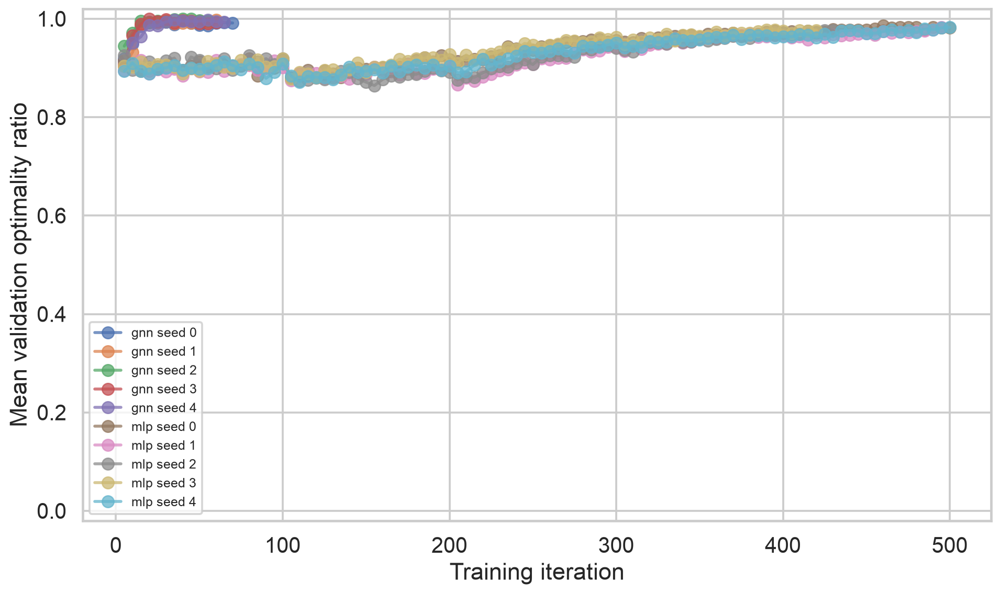
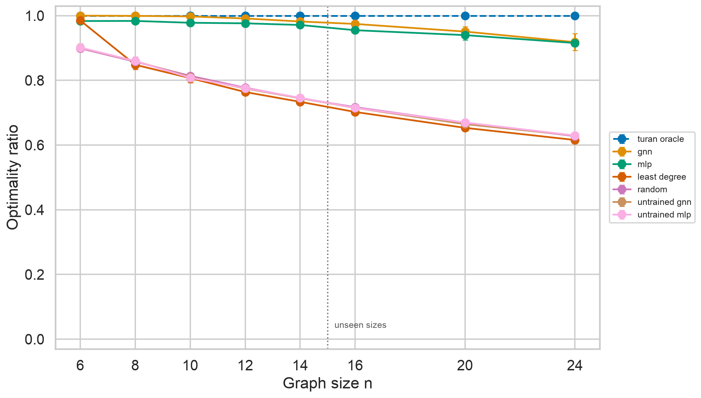
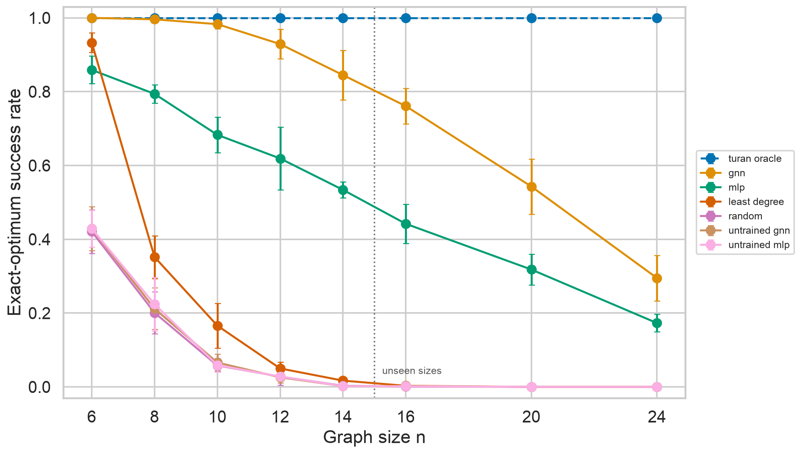

# Fixed-size MLP control for neural extremal graph search

**v0.2 research addendum — 10 August 2026**

## Abstract

The v0.1 experiment showed that a permutation-equivariant GNN trained on
triangle-free graph construction through `n = 14` retained strong performance
through the unseen size `n = 24`. This control asks whether that transfer can
be attributed specifically to equivariant message passing. A deliberately
non-equivariant fixed-size MLP was trained with the same features, legal action
set, curriculum, elite cross-entropy algorithm, optimizer, seeds, and budgets.
Its 37,990 parameters closely match the GNN's 38,337.

The MLP also generalized strongly. It achieved 93.68% mean optimality over the
three unseen sizes and 91.55% at `n = 24`, compared with 94.78% and 91.82% for
the GNN. However, its unseen exact-optimum rate was 31.1% versus 53.3% for the
GNN; at `n = 24`, the rates were 17.3% and 29.5%. The result rejects the simple
claim that equivariance alone explains transfer, while supporting a narrower
claim that the GNN is more reliable at recovering the exact construction.
All 56,000 evaluated graphs were triangle-free and terminal-maximal.

## 1. Control design

The fixed-capacity policy pads every graph to 24 vertices and concatenates the
upper adjacency triangle, all padded node features, and a node-presence mask.
A two-layer MLP produces a global graph representation. Legal candidates are
scored from that representation, the existing symmetric candidate statistics,
and a sum of endpoint one-hot position vectors. Thus edge endpoint order remains
irrelevant, but vertex relabelling can change the output distribution. A test
explicitly confirms this permutation sensitivity.

The full MLP uses width 67, giving 37,990 trainable parameters, 347 fewer than
the GNN (a 0.91% difference). Both models see the same four node features and
five candidate features. Both use the same hard legal-action mask, stochastic
sampling temperature, training sizes `[6, 8, 10, 12, 14]`, and five seeds.

## 2. Training behavior

The architectural control was substantially harder to train under the fixed
v0.1 curriculum gate. Every seed exhausted the 100-iteration budget at sizes
6, 8, 10, and 12. Four seeds eventually passed the final `n = 14` gate; seed 4
exhausted that stage as well. In total, 21 of 25 stage gates were missed. The
pipeline followed its declared rule in every case: it restored the best stage
checkpoint, recorded the missed gate, and continued without silently lowering
the threshold.

| Seed | Iterations | Passed gates | Missed gates | Final validation mean |
|---:|---:|---:|---:|---:|
| 0 | 500 | 1 | 4 | 98.14% |
| 1 | 495 | 1 | 4 | 98.26% |
| 2 | 430 | 1 | 4 | 97.64% |
| 3 | 420 | 1 | 4 | 97.69% |
| 4 | 500 | 0 | 5 | 98.24% |

This is a genuine negative training result relative to the GNN, whose v0.1
seeds passed all stages in 55–70 iterations. The MLP can learn the task, but it
does so far less efficiently under the same optimization protocol.



## 3. Evaluation protocol

Frozen checkpoints were evaluated at training sizes 6, 8, 10, 12, and 14 and
unseen sizes 16, 20, and 24. Every method-size-seed combination used 200
episodes. The seven methods were the trained GNN, trained MLP, their two
untrained initializations, uniform random, least degree, and the direct Turán
oracle. Means and 95% Student-t intervals are computed over five seed-level
means. GNN-minus-MLP comparisons below additionally use paired seed-level
differences.

## 4. Results

| `n` | Split | GNN ratio | MLP ratio | GNN exact | MLP exact |
|---:|:---|---:|---:|---:|---:|
| 6 | trained | 100.00% | 98.34% | 100.0% | 85.9% |
| 8 | trained | 99.94% | 98.37% | 99.6% | 79.4% |
| 10 | trained | 99.76% | 97.81% | 98.3% | 68.3% |
| 12 | trained | 99.13% | 97.63% | 92.9% | 61.9% |
| 14 | trained | 98.20% | 97.12% | 84.5% | 53.4% |
| 16 | unseen | 97.45% | 95.50% | 76.1% | 44.2% |
| 20 | unseen | 95.08% | 93.99% | 54.3% | 31.8% |
| 24 | unseen | 91.82% | 91.55% | 29.5% | 17.3% |



The MLP improved its unseen mean optimality by 26.54 percentage points over
its untrained initialization (93.68% versus 67.14%). At `n = 24`, it improved
by 28.60 points over its initialization and by 28.79 points over uniform
random. Its transfer is therefore learned, not merely an artifact of padding
or initialization.

The GNN's optimality advantage over the MLP was 1.94 ± 0.57 points at `n = 16`,
1.09 ± 1.63 at `n = 20`, and 0.27 ± 2.23 at `n = 24`, using paired 95%
Student-t intervals. The farthest-size mean-ratio difference is inconclusive:
both architectures usually find similarly dense maximal graphs.



Exact success distinguishes the models more sharply. The paired GNN advantage
was 31.9 ± 9.6 points at `n = 16`, 22.5 ± 8.5 at `n = 20`, and 12.2 ± 8.0 at
`n = 24`. These intervals remain positive. The GNN is more likely to recover
the precise balanced bipartite construction even where final edge density is
similar.

At `n = 24`, mean inference time per completed graph was 0.0868 seconds for the
GNN and 0.0787 seconds for the MLP. Runtime was not the primary endpoint, and
both learned policies were much slower than the simple baselines.

## 5. Safety and validity

Across 56,000 outputs, the independent verifier found zero forbidden triangles
and zero non-maximal terminal graphs. This validates the shared environment and
masking path for both model families; it does not mean either model learned the
constraint without enforcement.

The control changes architecture while holding the declared experimental
protocol fixed and matching parameter counts closely. It is not a pure test of
equivariance alone: the MLP also changes representation, global aggregation,
and optimization geometry. Its shared candidate statistics can carry
size-general information even though its padded adjacency weights and endpoint
positions are fixed. A stronger causal ablation would remove or vary these
components separately.

## 6. Conclusion

The v0.1 GNN result cannot be explained simply by saying that only a
permutation-equivariant architecture can transfer across graph sizes. A
position-sensitive fixed-size MLP learned a strong heuristic and nearly
matched the GNN's mean density at `n = 24`. Nevertheless, the GNN trained much
more efficiently and achieved materially higher exact-optimum success
throughout the range. Equivariance appears valuable for reliably recovering
the exact structure, but it is not necessary for useful size extrapolation in
this environment.

The next highest-value experiment is representation analysis: test whether GNN
embeddings recover the latent Turán bipartition and whether that signal predicts
the growing exact-success gap. Broader extrapolation should precede expansion
to `r = 3`.

## Reproduction

```bash
uv run negs train --config experiments/configs/mvp-mlp.toml --seed 0
# repeat for seeds 1, 2, 3, and 4
uv run negs evaluate --config experiments/configs/mvp-v0.2-eval.toml
uv run negs report --results results/mvp-v0.2/evaluation.csv
```

The repository retains all five best MLP checkpoints, compact trajectories,
the complete episode-level CSV, aggregate summary, and generated figures.
