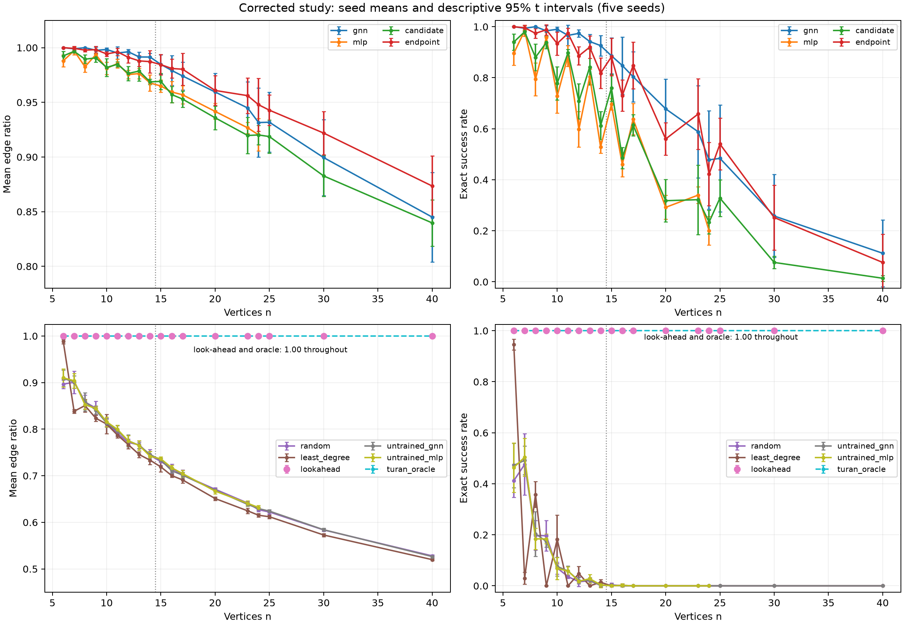
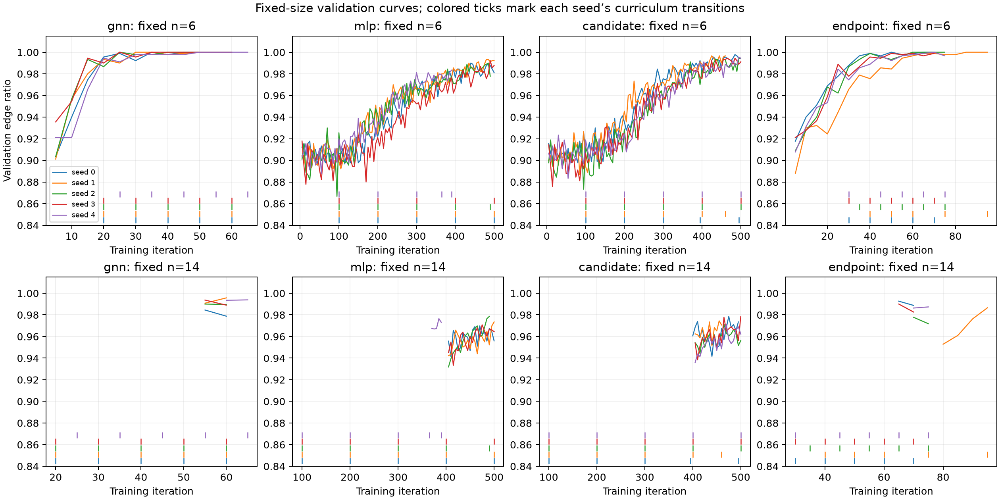
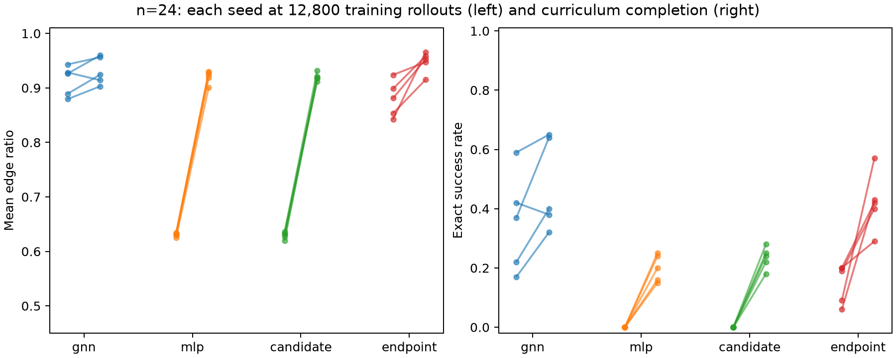
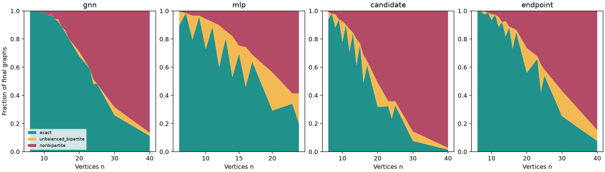
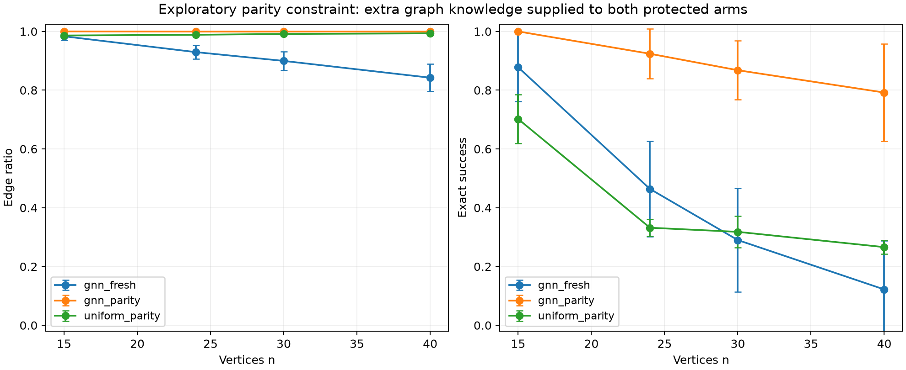

# Corrected Neural Extremal Graph Search study

**Assessment, 16 September 2026.** The project now supports a reproducible empirical study of learned construction and irreversible failures on a known-optimum graph task. It does not establish a superior extremal-graph solver or a new graph-theoretic result. The most useful findings are the strength of simple controls, the separation of edge quality from exact success, and a controlled intervention showing that learned action ranking remains useful when an explicit bipartite constraint prevents structural mistakes.

Twenty canonical training runs, 87,000 main evaluation graphs, 4,000 fixed-budget graphs and 6,000 supplementary graphs completed. Every persisted research graph passed independent triangle-freeness and maximality checks. No numerical or graph-verification failures occurred. Historical replays and engineering repetitions are separate validation exercises, not additional research replicates.

## Question and mathematical setting

Starting with an empty labeled graph, choose an edge whose endpoints have no common neighbor; stop when no such edge remains. This environment enforces triangle-freeness. The objective is to maximize the terminal edge count. “Maximal” means that no further legal edge can be added; it does not imply “maximum.” The exact optimum is

\[
T(n)=\lfloor n^2/4\rfloor,
\]

attained by the balanced complete bipartite graph. Reported optimality is \(|E|/T(n)\), not the conventional graph density \(|E|/\binom n2\). Exact success requires equality; absolute gap is \(T(n)-|E|\). [MATHEMATICS.md](MATHEMATICS.md) gives a self-contained bound/equality proof and diagnostic definitions.

The research question is what learned scoring adds to legality and supplied statistics, whether message passing is necessary, and which decisions prevent completion to the optimum. A known-optimum problem is valuable for exact diagnosis, but successful construction here is not evidence of discovering an unknown extremal bound.

For a bipartite partial graph, each connected component has two possible orientations of its color classes. Balanced completion is possible exactly when choosing one class size from each component can sum to \(\lfloor n/2\rfloor\). An exact subset-sum calculation therefore identifies the first irreversible loss of optimal completion, including odd sizes. An odd cycle makes all bipartite completion impossible. Every maximal bipartite triangle-free output is complete bipartite; its remaining deficiency is partition imbalance. These diagnostic oracles are excluded from primary model inputs and rewards.

## Provenance and implementation

The clean starting revision was `87a6bc5a52f973b8025bdd5efeb0791fcc4dcb01`. The original checkout and published artifacts remain preserved. The isolated branch is `research/corrected-transfer-study`; canonical training uses the common source snapshot committed at `4b14e4b`.

Three confirmed defects were repaired: invalid logits now cause explicit failures instead of accidental last-edge choices; `episode-v2` gives each episode an independent random stream; and resume validates the resolved configuration and optimizer before touching existing records. Launch metadata is preserved, resume events append, and all relevant random states are restored. Historical `legacy-batch-v1` remains available with its original grouping semantics. Changing to independent streams intentionally changes historical deterministic trajectories.

A further checkpoint transaction defect was found while the frozen cohort ran: a stage-advancing resume checkpoint could be published before corresponding stage artifacts. The repair saves those artifacts first and supports interrupted finalization. All twenty canonical runs were uninterrupted and use the same original snapshot. A separate complete seed-0 GNN repetition under the repaired implementation matched all sixty iteration records and final parameters exactly. Final evaluation uses `2ea4165` with unchanged inference behavior. Both snapshots and the [equivalence record](boundary-repair-equivalence.json) are retained; this deviation is explicit.

There were twenty recovered orchestration errors after successful training saves: a runner attempted to relativize an already-relative checkpoint path. Completion records and checkpoint hashes confirmed that training had finished. The runner was fixed and reconciled existing outputs; no seed was replaced or trained selectively. The [ledger](ledger.jsonl) preserves these events.

The suite now contains **64 passing tests**, covering numerical failures, terminal masks, batching and ordering, legacy replay, actual interrupted training/evaluation, incompatible resume requests, final-stage interruption, exact diagnostics, look-ahead scoring, and corrupt evidence rejection. Independent evidence checks recalculated 250 trajectory annotations and reproduced 165 checkpoint outputs as singleton or reversed-pair batches. See [independent audit](independent_audit.json).

## Frozen protocol and controls

[protocol.json](protocol.json) was fixed before canonical training. Four families each use training seeds 0–4. Training sizes are 6, 8, 10, 12 and 14. Each CEM iteration collects 256 trajectories, retains the top 20% separately by size, and applies two training epochs with AdamW, learning rate 0.0003, weight decay 0.0001 and gradient clipping at 1. There was no new hyperparameter search.

Validation uses 100 fresh episodes per introduced size every five iterations. A stage advances after the newest size reaches mean ratio 0.97 twice, or after 100 iterations. Both best-validation weights and optimizer state are restored between stages. Final selection uses the best mean across introduced sizes within the final stage. Selected scores and last-event scores are retained separately.

| Learned policy | Parameters | Information and effective architecture |
|---|---:|---|
| GNN | 38,337 | Three mean-message-passing layers, symmetric endpoint/candidate scorer |
| MLP | 37,990 | Fixed-capacity global encoder plus shared candidate scorer; maximum 24 vertices |
| Endpoint | 13,185 | Independently encoded node features and symmetric scorer; zero message passing |
| Candidate only | 449 | Existing symmetric candidate statistics only |

Controls also include untrained GNN/MLP, uniform random, least-degree, one-step look-ahead, and direct Turán construction. Look-ahead chooses a legal edge leaving the most legal actions, with seeded tie-breaking; its efficient score was checked against brute force. The direct construction deliberately uses the known solution.

The full panel is 6–17 inclusive, then 20, 23, 24, 25, 30 and 40: eighteen sizes, 100 episodes per method/size/seed. MLP variants above 24 are unsupported, not failures. Sizes 16/20/24 were already observed historically; newly introduced sizes were frozen before evaluation. There was no model selection on the panel and no optional seed expansion.

The primary contrast is GNN minus MLP mean optimality at n=24. Learning comparisons use five training seeds as the replication unit. Intervals are paired Student-t intervals with four degrees of freedom. Secondary and supplementary intervals are descriptive and unadjusted for multiple comparisons. Five hundred episodes at a size do not constitute five hundred independently trained models. Seed tables expose the substantial variation and small-replication uncertainty.

The environment supplies considerable information. Common-neighbor count is zero for every legal candidate; the r feature is constant. Normalized degree, progress and legal-incidence statistics expose useful scale and structural information. The MLP's shared candidate scorer also transfers across edges. The smaller controls are not parameter-matched architecture isolation, and common hyperparameters need not be equally well tuned for each family.

## Corrected results

All values below average five seed-level means, with 100 episodes per seed and size.

| Method | n=24 optimality | n=24 exact | n=40 optimality | n=40 exact |
|---|---:|---:|---:|---:|
| GNN | 93.150% | 47.8% | 84.506% | 11.2% |
| MLP | 92.029% | 20.0% | Unsupported | Unsupported |
| Endpoint | 94.782% | 42.2% | 87.348% | 7.6% |
| Candidate only | 92.017% | 23.4% | 83.972% | 1.4% |
| Untrained GNN | 62.942% | 0% | 52.658% | 0% |
| Uniform random | 62.710% | 0% | 52.803% | 0% |
| Least-degree | 61.522% | 0% | 51.992% | 0% |
| Look-ahead | 100% | 100% | 100% | 100% |
| Direct Turán | 100% | 100% | 100% | 100% |

**The primary mean-optimality comparison is inconclusive:** GNN minus MLP is +1.12 percentage points, 95% interval [−1.47, +3.71]. Its exact-success difference is +27.8 points [7.83, 47.77], a favorable secondary result that is positive in each seed pair. At n=24 the GNN-minus-endpoint differences are −1.63 optimality points [−5.01, +1.74] and +5.6 exact-success points [−7.47, +18.67]. These data do not establish a held-out benefit from message passing over the endpoint control.

GNN n=24 exact rates by seed are 32%, 64%, 40%, 38% and 65%; MLP rates are 20%, 24%, 25%, 15% and 16%. GNN optimality ranges from 90.30% to 95.98%. The tiny candidate scorer reaches essentially the same observed mean optimality as the MLP. These controls materially weaken an interpretation based primarily on sophisticated global representations. They do not prove equivalence or identify a unique sufficient feature.

Look-ahead achieved the optimum on **all 9,000 of its evaluated graphs**, across every declared size and seed group. This is finite empirical evidence, not a proof that the heuristic always succeeds. Together with the direct known construction, it rules out a practical solver-superiority claim for the neural approach on this benchmark.

GNN transfer to odd interpolation sizes remains strong: n=7/9/11/13 exact rates are 99.4/98.4/96.6/94.2%. Extrapolation declines: n=16/20/24/30/40 exact rates are 84.8/67.8/47.8/25.8/11.2%, while optimality is 97.92/95.95/93.15/89.95/84.51%. High mean edge quality can conceal severe exact failure. Odd/even oscillations in other methods also reflect the allowed one-vertex difference between optimal odd-size parts; they are not automatically evidence of a parity-processing defect.

Full [seed results](tables/seed_results.csv), [summaries](tables/summary.csv), [paired contrasts](tables/comparisons.csv) and [outcome-conditioned quality](tables/outcome_quality.csv) are retained.

## Training budgets and computational cost

| Family | Mean iterations (range) | Mean training episodes | Mean sampled actions | Mean optimizer updates | Mean gates passed / 5 |
|---|---:|---:|---:|---:|---:|
| GNN | 61 (60–65) | 15,616 | 242,604 | 444 | 5.0 |
| Endpoint | 77 (70–95) | 19,712 | 289,603 | 532 | 5.0 |
| MLP | 476 (390–500) | 121,856 | 1,925,719 | 3,726 | 0.6 |
| Candidate | 491 (460–500) | 125,696 | 2,019,562 | 3,894 | 0.6 |

The twenty runs collected 1,414,400 training episodes and 319,300 validation episodes. Under this curriculum, GNN and endpoint learn much faster than the other families. The final comparison is training to the declared criterion/cap; it does not match realized resources. MLP/candidate advancing at caps does not mean they passed the gates.

At iteration 50, each model has exactly 12,800 training episodes. At n=24 the GNN/endpoint/MLP/candidate ratios are 91.33/88.00/63.07/62.94%, and exact rates 35.4/14.8/0/0%. This supports an advantage under the declared training-rollout budget. It is not equal total interaction or optimization: mean validation episodes at that point are 2,140/1,460/1,000/1,000, optimizer updates 314/246/200/200, and size exposure differs because curriculum progression differs. A fixed-size, fixed-update study would isolate those effects better.

Canonical runs use CPU, one PyTorch thread per worker and up to four concurrent workers. Per-run launch-to-completion times are retained but cannot establish architecture speed rankings. A separate serial profile uses one warmup and three timed repeats, a seed-0 checkpoint, excluded timing seeds and no diagnostic replay. At n=40, mean single-graph generation latency was 0.447 seconds for GNN, 0.437 for endpoint, 0.349 for candidate, 0.155 for look-ahead and 0.000115 for direct construction. The corresponding GNN batch-eight amortized cost was 0.388 seconds per graph. These local microbenchmarks include different numbers of construction steps and have limited repetitions; they are not general hardware performance claims. [Raw timings and environment](serial_inference_profile.json) distinguish latency from amortized cost.

## Irreversible failures and representations

At n=24, the GNN's 500 outputs comprise 239 exact, 18 unbalanced bipartite and 243 nonbipartite graphs. Endpoint gives 211/99/190; MLP 100/107/293; candidate 117/62/321. Endpoint's higher observed mean quality coexists with lower exact frequency and more unbalanced bipartite outputs. The two metrics answer different questions.

At n=40, GNN outputs comprise 56 exact, 11 unbalanced bipartite and 433 nonbipartite graphs. First irreversible loss is an odd-cycle edge in 427 episodes and partition imbalance in 17. A trajectory can first lose balanced feasibility and later become nonbipartite, so first-loss causes and final categories must not be equated. Among failed trajectories, the mean of per-seed conditional first-loss steps is 43.17, far before the 400-edge optimum.

On C8, all twelve legal edges have identical representations/logits under this encoder: eight permit a 16-edge completion, four opposite-vertex chords permit at most thirteen. Exhaustive continuation enumeration independently confirms these values. Conditional bad-action mass is one third, giving a conditional expected upper bound of fifteen edges even with optimal continuation. Depths 0, 1, 3 and 8 across five initializations and all five corrected trained GNNs reproduce the equality. This is an exhibited architectural limitation, not a global ceiling from the empty graph. Six tractable partial-graph collections and maximizing witnesses are retained in [exact_diagnostics.json](exact_diagnostics.json).

Terminal balanced complete bipartite graphs have identical supplied node inputs and identical embeddings at every layer by symmetry. That observation is mathematically expected and cannot diagnose unsuccessful training.

Actual-trajectory probes examine the first ten episodes per seed at n=14/24/40. At n=24 there are 4,538 feasible GNN decisions, 21 states with a structurally identical action group containing both preserving and destructive choices, and 22 first losses; none of those losses selected a destructive member of such a group. At n=40 the corresponding totals are 4,230, 77 and 45, with one loss selecting a destructive member of a mixed group. No probed GNN state forced positive failure probability across every available representation group. Endpoint and candidate have substantially more mixed-group failures (24/49 and 36/49 first losses at n=40).

Thus structural indistinguishability is both a rigorous constructed limitation and an observed local contributor, but the measured form is not the dominant explanation of actual GNN failures. Other safe groups existed, and the sufficient symbolic certificate does not test every cross-state or finite-depth limitation. Nor does it measure all possible learned representation collapse. MLP certificates are unsupported and reported as missing, not zero. Probability-mass and per-episode diagnostics are retained in [probe tables](tables/probes.csv).

## Supplementary intervention: explicit bipartite preservation

The original intervention gate depended on consequential aliasing. After early diagnostics showed predominantly odd-cycle losses, a separate exploratory protocol explicitly broadened that gate. [intervention-protocol.json](intervention-protocol.json) predates all supplementary draws. It does not change or retrospectively promote the primary comparison.

Three arms use the five frozen GNNs at n=15/24/30/40, 100 fresh episodes per cell: unmodified GNN, GNN followed by an explicit parity mask, and uniform sampling with the same mask. Both protected arms receive connected-component membership and color parity. They forbid edges joining same-color vertices within a component, while still allowing arbitrary component merges. The GNN scores the original candidates/features before this extra mask. No balanced-completion oracle, retraining or tuning is used.

| Size | Fresh GNN exact | GNN + parity exact | Uniform + parity exact | GNN + parity optimality |
|---|---:|---:|---:|---:|
| 15 | 87.8% | 100% | 70.2% | 100% |
| 24 | 46.4% | 92.4% | 33.2% | 99.943% |
| 30 | 29.0% | 86.8% | 31.8% | 99.941% |
| 40 | 12.2% | 79.2% | 26.6% | 99.944% |

All protected outputs are bipartite, as guaranteed by the intervention. Remaining errors are imbalance. At n=40 the exact-success gain over fresh GNN is 67.0 points, descriptive interval [41.75, 92.25]; over uniform-parity it is 52.6 points [36.68, 68.52], positive in every seed pair. Uniform-parity already reaches 99.347% mean optimality at n=40, so near-perfect edge ratio alone is weak evidence of sophisticated balancing. The stronger observation is the learned scorer's additional exact-success benefit under identical constraints.

This supports useful learned ranking within the protected construction process, consistent with balancing behavior. It does not establish an explicit internal partition algorithm, show that message passing creates the benefit, or causally attribute original errors to C8-style aliasing. The added parity constraint is mathematical knowledge supplied externally. Look-ahead remains perfect in the main finite panel. [Supplementary seed results](tables/intervention_seed_results.csv) and [contrasts](tables/intervention_comparisons.csv) remain separate from primary observations. [Serial intervention timings](serial_intervention_profile.json) include the extra coloring and longer protected trajectories; concurrent study timings are not used to isolate overhead. Within the separate intervention harness at n=40, mean single-graph times were 0.581 seconds for fresh GNN, 0.777 for parity-protected GNN, and 0.629 for uniform-parity; batch-eight amortized costs were 0.483, 0.694 and 0.615 seconds per graph. These compare complete constructions, not coloring overhead alone.

## Literature and claim boundaries

Cross-entropy graph construction is established in [Wagner's work](https://arxiv.org/abs/2104.14516). General construction frameworks and comparisons appear in [Angileri et al.](https://arxiv.org/abs/2406.12667), [RLGT](https://arxiv.org/abs/2602.17276), and [Darvariu et al.](https://arxiv.org/abs/2001.11279). GNN expressivity limits are established by [Xu et al.](https://arxiv.org/abs/1810.00826), and local-structure effects on size generalization by [Yehudai et al.](https://proceedings.mlr.press/v139/yehudai21a.html). Algorithmic generalization requires broader evaluation than success on a short size panel; [CLRS](https://proceedings.mlr.press/v162/velickovic22a.html) supplies relevant evaluation context. The more recent [CEM/GIN rigidity study](https://arxiv.org/abs/2605.12427) also makes generic CEM-plus-GNN novelty claims untenable. [RELATED_WORK.md](RELATED_WORK.md) records the primary-source review and remaining novelty checks.

| Claim | Status | Evidence and limit |
|---|---|---|
| Numerical and resume defects are repaired | Verified engineering result | 64 tests, failure records, interrupted-run checks; platform-specific reproducibility limits remain |
| Corrected GNN has better n24 mean optimality than MLP | Not established | Primary paired interval includes zero |
| GNN improves n24 exact success over MLP | Supported secondary result | All five pairs positive; unadjusted interval and small cohort |
| Message passing is necessary for transfer | Not established | Endpoint control transfers strongly; direct comparison inconclusive |
| Learning useful candidate ranking occurs | Supported empirically | Learned controls exceed untrained/random; parity GNN exceeds information-matched uniform |
| C8 exposes unavoidable action ambiguity at that state | Established conditional limitation | Symmetry plus exact continuation values; not a global ceiling |
| C8-style ambiguity explains most GNN failures | Unsupported | One of 45 probed n40 first losses selected a bad mixed-group action |
| Explicit parity constraints improve this frozen GNN | Supported exploratory intervention | Fresh arms, all seeds, independent verification; extra domain knowledge |
| A new superior neural solver has been developed | Unsupported | Look-ahead 9,000/9,000 exact and cheaper locally; direct construction known |
| An arbitrary-size algorithm or new extremal theorem was learned | Unsupported | Finite panel, declining exact success, no such proof |

## Reproduction and research readiness

[README.md](README.md) contains exact regeneration, verification, historical replay and resume commands. The portable evidence archive holds all canonical training logs/checkpoints/source snapshots, final graphs and action sequences, plus historical inputs and engineering checks. [bundle-manifest.json](bundle-manifest.json) and the per-file manifest give checksums. Source and evidence are both required; the unpacked artifact tree remains outside Git, while the complete evidence archive is committed as the portable handoff. All five new figures and six historical figures are regenerable from retained inputs. The clean-checkout exercise and its precise scope are recorded in [clean_checkout_validation.json](clean_checkout_validation.json); it reproduced 31 retained output files exactly, verified all 97,000 research graphs, freshly replayed 640 historical outputs with matching edge counts, and was followed by a 64-test pass in that clone. It reuses the installed dependency environment and is not a fresh-machine installation test.

The study is a substantial engineering and empirical result with a plausible focused paper direction. It is not yet a convincing new-method paper. The strongest candidate narrative is that learned construction can maintain good edge quality while losing exact feasibility early; supplied graph knowledge and simple scoring controls explain more than an architecture-only comparison suggests. The parity intervention gives a concrete experimental handle, while the rigorous C8 example must remain separate from any claim of dominant causal failure.

Priorities for a credible submission are:

1. **Identify the source of the parity-protected ranking benefit.** Freeze a follow-up comparing endpoint and candidate scorers under the same parity mask, with a simple deterministic balancing control. This is the highest-value unresolved question: does message passing add anything once odd-cycle errors are removed?
2. **Separate curriculum from representation.** Use fixed-size exposure and matched total interactions/updates, with declared equal tuning budgets. Retain the present null primary result; do not optimize until it disappears.
3. **Test the mechanism on fresh graph states and sizes.** Predeclare state collections that distinguish component parity, component balance and local statistics; measure intervention effects without selecting favorable examples. Add training seeds based on precision or a prospective power/resource calculation, not significance chasing.
4. **Resolve heuristic and novelty positioning.** Investigate whether the look-ahead rule has a provable guarantee or a small counterexample. Compare the proposed mechanism precisely with current primary literature and seek independent reproduction/review.
5. **Write around the supported contribution.** Release the repair/protocol/evidence package when authorized, then build a paper around explicit claims, negative controls and limits. A workshop or focused empirical submission may be reasonable after the mechanistic follow-up; venue fit and acceptance are not established by this study.

Further RL algorithms, K4-free expansion and application building are lower priority. They would add scope before resolving the central explanatory uncertainty.
