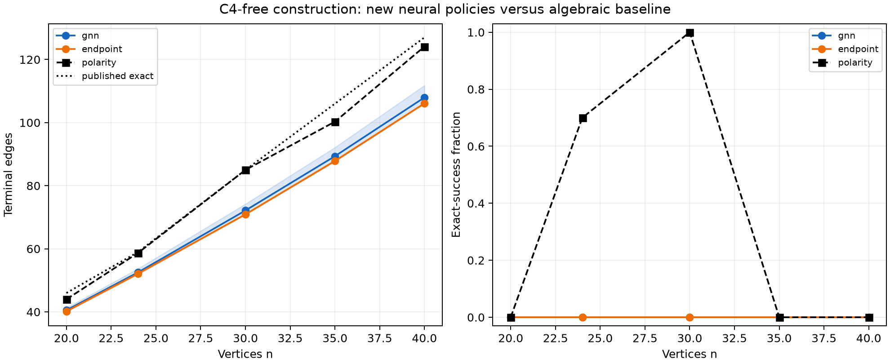

# A harder problem, but no better neural solver yet

**24 September 2026.** We moved from triangle-free edge maximization, whose optimum has a simple explicit construction, to maximizing edges in a graph with no four-cycle. This is a more meaningful search target: the general value \(\operatorname{ex}(n,C_4)\) is not known in closed form, while [Afzaly and McKay's extremal-graph data](https://users.cecs.anu.edu.au/~bdm/data/extremal.html) give exact edge counts at the five benchmark sizes. Orthogonal-polarity graphs are an established strong construction, not a newly discovered neural idea; [He, Ma and Yang](https://arxiv.org/abs/1912.00986) summarize their extremal role and the difficulty of general exact results.

The first neural pilot did **not** produce a better solver. The newly trained GNN scored slightly above an endpoint-only network under a fixed training budget, but both were far below the polarity construction and reached the exact edge count in none of their 1,500 evaluated graphs each. This is a result about the specified training regime and representation, not a proof that neural search cannot help on \(C_4\)-free graphs.

## Problem and verification

Given \(n\) labeled vertices, add edges while forbidding every four-cycle, including non-induced cycles; maximize the final edge count. A graph is \(C_4\)-free exactly when no pair of vertices has two common neighbors. This yields a cheap independent validity check. A terminal graph is *maximal* when every missing edge would introduce a four-cycle; maximality does not imply the maximum number of edges. Every pilot output was checked for both properties, and the learned outputs were additionally replayed from saved checkpoints with different batch groupings.

The independently published exact edge counts at \(n=20,24,30,35,40\) are respectively **46, 59, 85, 106, 127**. Their use is limited to evaluation and consistency checks, not training reward or action choice. The [baseline protocol wording correction](../c4_pilot/PROTOCOL_ERRATUM.md) clarifies that the n=40 *number of optimum graphs* is only lower-bounded in the source table; the edge optimum 127 is exact.

## Frozen baseline screen

The [nonlearned protocol](../c4_pilot/protocol.json) was committed at `21bc9fe` before 300 graph draws: ten seeds at each of five sizes for uniform, minimum-degree, sampled look-ahead, edge-swap repair, polarity, and polarity plus repair. Full [graph evidence](../c4_pilot/results.jsonl) and [aggregates](../c4_pilot/summary.csv) are retained.

| n | Exact edge count | Best simple look-ahead | Best polarity | Mean polarity |
|---:|---:|---:|---:|---:|
| 20 | 46 | 44 | 45 | 44.0 |
| 24 | 59 | 57 | 59 | 58.7 |
| 30 | 85 | 76 | 85 | 85.0 |
| 35 | 106 | 96 | 101 | 100.3 |
| 40 | 127 | 114 | 125 | 124.1 |

The algebraic construction leaves some headroom at 35 and 40 vertices, but it dominates the naive search methods. Two-hundred-step edge deletion and refill did not improve its best graph at those sizes in the declared runs. The methods used different amounts of compute; this screen is not an equal-time leaderboard. It establishes the bar that a practical learned solver must clear.

## Separately frozen neural test

The [neural protocol](protocol.json) was committed at `59ee091` before training. Three fresh GNNs and three endpoint-only networks were trained from scratch at \(n=20\) with identical 5,120 terminal rollouts, 320 optimizer updates, 800 validation episodes, elite trajectory counts, prefix lengths, optimizer settings, and evaluation seeds. The policy uses a new \(C_4\)-legal action mask and graph features (degree, legal-edge incidence, construction progress, two-hop reachability, endpoint statistics, and common neighbors). The GNN has three mean-message-passing layers and 38,337 parameters; the endpoint scorer has no message passing and 13,185 parameters. Best checkpoints were chosen only by \(n=20\) validation mean edge count.

| n | Exact | GNN mean (best graph) | Endpoint mean (best graph) | Polarity mean (best graph) |
|---:|---:|---:|---:|---:|
| 20 | 46 | 40.55 (45) | 40.22 (43) | 44.0 (45) |
| 24 | 59 | 52.54 (57) | 52.14 (55) | 58.7 (59) |
| 30 | 85 | 72.14 (78) | 70.92 (75) | 85.0 (85) |
| 35 | 106 | 89.36 (96) | 87.84 (92) | 100.3 (101) |
| 40 | 127 | 107.97 (117) | 106.11 (110) | 124.1 (125) |

Each learned mean averages three training-seed means, 100 new graph draws per seed/size. At \(n=35\), the exploratory paired GNN-minus-endpoint mean difference is +1.52 edges, descriptive 95% interval [−3.93, +6.97]; at \(n=40\), it is +1.86 [−6.23, +9.95]. Three seeds are too few for a reliable architecture comparison. Neither policy ever reached an optimum, including on its own training size. The GNN's best \(n=40\) graph still had eight fewer edges than the best polarity graph in the ten-seed screen. [Seed-level data](tables/seed_results.csv), [summaries](tables/summary.csv), [contrasts](tables/paired_contrasts.csv), [training budgets](tables/training.csv), and [full final graphs](results.jsonl) support these statements.

Realized construction actions were close between the two learned families (about 206,000 per run) because both ended with roughly 40 edges at the training size. Parameter count and representation still differ. The GNN reached a higher mean on most held-out sizes, but its seed-level variation is substantial and this configuration mostly performs near degree-based greedy construction. The polarity method uses a strong mathematical prior unavailable to the learned policy, so the comparison is a *solver-quality challenge*, not a causal architecture ablation. Timings are retained but run in different harnesses and concurrency settings; no equal-wall-time ranking is claimed.

## Evidence boundary and decision

The [training archive](training-evidence-v1.tar.gz) contains all six selected checkpoints and their complete 80-iteration logs, with a [checksum manifest](bundle_manifest.json). The pilot retains 300 nonlearned and 3,000 learned final graphs; each passes the independent four-cycle and maximality checks. A [replay audit](independent_audit.json) matched 60 reversed-pair and 30 singleton neural outputs to their saved checkpoints and seeds. The [clean-checkout record](clean_validation.json) states which outputs and tests were regenerated; it reuses the installed environment and does not retrain the six models.

The answer to the original solver question is therefore **yes, we can choose a genuinely harder problem—but this first neural attempt has not found a better solver**. The current result does not warrant a solver-superiority or new-extremal-bound claim. It does justify changing the *search formulation* rather than merely scaling this edge-by-edge CEM run: start from a strong polarity or other published construction, use larger structure-preserving edits or vertex-subset choices, and compare a learned proposal policy with a strong nonlearned local-search policy under the same compute budget. Develop on the now-inspected \(n\le40\) sizes, then freeze a new protocol for untouched larger sizes and check against the best published lower bounds before claiming any new finite construction. The present C4 pilot is an engineering and negative-control result, not yet a paper-worthy improvement.
