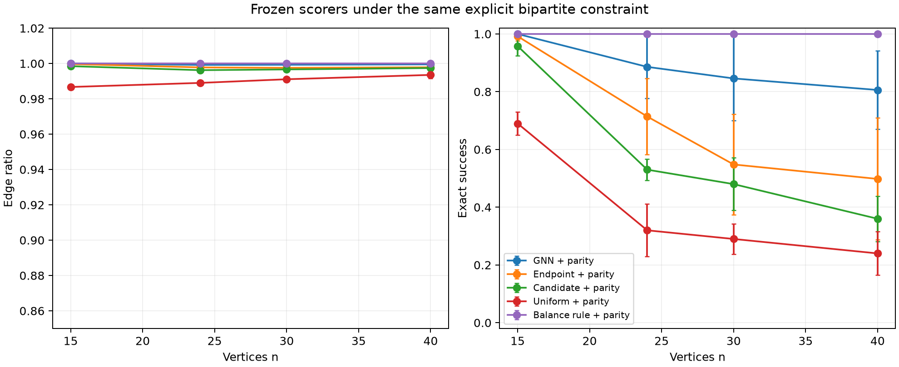
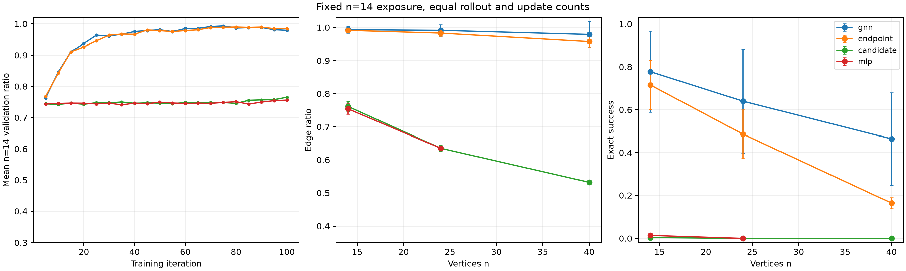

# Parity, balancing, and matched training: follow-up research note

**24 September 2026.** This note supplements the [corrected study](../RESEARCH_REPORT.md); its evaluation draws and newly trained models are separate. It reports what the completed follow-up establishes, where causal interpretation remains limited, and which claims could support a paper. The benchmark starts from an empty graph, adds only triangle-free edges, and seeks the known optimum \(\lfloor n^2/4\rfloor\). Exact success means attaining that edge count; mean edge ratio can stay near one even when exact success falls sharply.

## Frozen-weight parity comparison

The [prospective protocol](protocol.json) fixes five existing corrected-study checkpoints per learned family, four sizes (15, 24, 30, 40), 100 fresh episodes per method/seed/size, and a primary paired comparison of GNN versus endpoint exact success at \(n=40\). All five policies receive the same externally supplied parity mask. The learned scorers are frozen and score the original legal candidates before that mask is applied. The comparison uses five training seeds as the replication unit, with a two-sided paired-t interval; additional contrasts are descriptive and unadjusted. [Seed-level data](tables/parity_seed_results.csv), [summaries](tables/parity_summary.csv), and [paired contrasts](tables/parity_comparisons.csv) retain the full numbers.

| Policy with parity mask | Exact at n=15 | Exact at n=24 | Exact at n=30 | Exact at n=40 |
|---|---:|---:|---:|---:|
| GNN | 100.0% | 88.6% | 84.6% | 80.6% |
| Endpoint scorer | 99.2% | 71.4% | 54.8% | 49.8% |
| Candidate-only scorer | 95.8% | 53.0% | 48.0% | 36.0% |
| Uniform | 69.0% | 32.0% | 29.0% | 24.0% |
| Explicit component-balancing rule | 100.0% | 100.0% | 100.0% | 100.0% |

The **predeclared primary difference** is +30.8 percentage points in GNN exact success over endpoint at \(n=40\), 95% interval **[+11.1, +50.5]** over five paired training seeds; all five pair differences are positive (+55, +20, +39, +22, +18 points). The GNN also exceeds candidate-only by 44.6 points at that size. Conversely, the balancing rule exceeds GNN by 19.4 points. These controls substantially clarify the previous result: the GNN's useful ranking persists beyond the uniform and simpler learned scorers when odd-cycle actions are excluded, but it does not solve the protected task as well as a direct component-size rule.

The parity mask itself supplies graph-theoretic information unavailable to the unprotected models. The frozen families were trained for unequal realized numbers of episodes, optimizer steps, and curriculum stages, and differ in features and parameter count. The paired result therefore establishes **a difference between these frozen policies in this protected environment**, not that message passing alone caused it. The n=40 GNN edge ratio is 99.9515%, despite exact success of only 80.6%; the remaining failures are partition imbalance. Near-perfect mean ratio is an especially weak standalone claim on this task.

## A stronger constructive baseline

The balancing control selects a parity-allowed edge minimizing the imbalance between the two color classes of its resulting connected component, with random ties. It uses no learned parameters and no future-return or subset-sum oracle, but it does explicitly use component coloring and class sizes. It reached the optimum in all 2,000 declared episodes. More importantly, [an elementary invariant](BALANCING_PROOF.md) proves optimal termination from the empty graph for **every** \(n\ge2\) and every tie choice under the stated mask. Balanced nontrivial components and isolates can always be joined or filled by a zero-imbalance move; at most one isolate remains when those moves run out. For odd \(n\), attaching that last isolate gives the two optimum part sizes, and every remaining permitted edge merely completes their cross edges.

This is a useful *negative control*, not a new extremal theorem. The known balanced complete bipartite solution already exists, and the rule incorporates exact structural information. It eliminates a solver-superiority claim for the neural method on the current benchmark. A defensible research angle is instead to ask what structural behavior a learner approximates **without** being handed the component-balancing decision rule, and when it fails.

## One-step look-ahead: finite success, limited guarantee

The earlier one-step policy reached optimum on 9,000/9,000 finite evaluation graphs. A new [predeclared exact reachability search](lookahead_protocol.json) follows every tied best action from the empty graph through \(n=8\), finding no destructive action among 2, 7, 25, 186, 1,121, 12,027 and 64,464 labeled reachable states for \(n=2,\ldots,8\). An exploratory \(n=9\) search hit its cap without a counterexample and is incomplete.

The policy is **not** guaranteed to preserve optimal completion from every triangle-free partial graph. At \(n=6\), a three-edge star on vertices 0–3 with isolated vertices 4 and 5 can still complete to \(K_{3,3}\). The uniquely best immediate move, edge (4,5), loses only one currently legal action but forces at most eight terminal edges; another legal move permits nine. Exact continuation enumeration and independent maximizing-witness checks establish those values. This state was not reached in the exhaustive empty-start \(n=6\) search, so an arbitrary-size guarantee or failure **from the empty start** remains open. See the [precise counterexample and limits](LOOKAHEAD_LIMIT.md).

## Fixed-size matched-update training

The separate [matched protocol](matched_protocol.json) trains GNN, endpoint, candidate-only, and fixed-size MLP models from scratch at \(n=14\), five seeds each, using the same 25,600 terminal rollouts, 62,400 elite-prefix action pairs, 800 optimizer updates, 204,800 optimizer pair presentations, and 2,000 validation episodes per run. It selects each run's best \(n=14\) validation checkpoint and evaluates fresh seeds at \(n=14,24,40\), excluding the MLP's unsupported \(n=40\). Its predeclared primary contrast is GNN minus endpoint exact success at \(n=24\). This is an explanatory robustness check after the earlier n=24 and n=40 results were inspected; it is not a pristine replication. Total environment action counts can still differ with rollout length, as can architecture, feature information, parameter count and optimization difficulty.

All 20 runs met the declared rollout, selected-pair, update, and validation counts. Their selected \(n=14\) validation mean ratios were 99.49% for GNN, 99.32% for endpoint, 76.76% for candidate-only, and 76.07% for MLP. The last two families remained close to their initial performance under this particular fixed-size, truncated-prefix training variant; their poor extrapolation here is **not** evidence that these architectures cannot learn with a different schedule or tuning budget. Mean training *action* counts were 1,191,160 GNN, 1,188,805 endpoint, 938,842 candidate-only, and 936,342 MLP. Thus the primary GNN–endpoint action exposure was close, but the four-way study did not match total interaction.

| Newly trained policy | n=14 exact | n=24 exact | n=40 exact | n=24 mean edge ratio |
|---|---:|---:|---:|---:|
| GNN | 77.8% | 64.0% | 46.4% | 99.14% |
| Endpoint scorer | 71.6% | 48.6% | 16.4% | 98.31% |
| Candidate-only scorer | 0.4% | 0% | 0% | 63.51% |
| MLP | 1.4% | 0% | Unsupported | 63.52% |

The **predeclared primary GNN-minus-endpoint difference** at \(n=24\) is +15.4 exact-success points, 95% interval **[−8.0, +38.8]** across five paired training seeds. One seed pair favors endpoint by 11 points. This comparison is inconclusive; the matched study does not establish a reliable GNN advantage over endpoint at its primary size. At \(n=40\), a *secondary, unadjusted* difference is +30.0 points [8.7, 51.3], positive in all five pairs. The \(n=24\) mean-edge-ratio contrast is +0.83 points [−1.45, +3.11]. These results are compatible with a message-passing benefit under this schedule, but do not isolate it: architecture, model information and optimization difficulty remain entangled, and the secondary \(n=40\) result is not a replacement for the inconclusive primary comparison. See the [training budgets and selections](tables/matched_training.csv), [seed results](tables/matched_seed_results.csv), [summaries](tables/matched_summary.csv), [paired contrasts](tables/matched_comparisons.csv), and [validation curves](tables/matched_validation_curves.csv).

## Evidence and reproducibility boundary

The parity panel contains 10,000 saved graphs and action sequences; the matched-training panel adds 5,500 held-out graphs. Every saved final graph was independently checked for triangle-freeness, maximality, edge count, and record identity. An additional [parity audit](independent_audit.json) recomputed 200 trajectory-prefix diagnoses using NetworkX and subset-sum, then replayed 100 reversed-pair and 50 singleton cases from checkpoints and saved episode seeds. A separate [matched-study audit](matched_independent_audit.json) checked 55 trajectory prefixes and replayed 70 reversed-pair and 35 singleton cases. The balancing implementation has an independent NetworkX score check, batch-order invariance checks, and exhaustive tie-path tests through \(n=6\). The finite look-ahead reachability and partial-state values are separately serialized.

The [checksummed follow-up archive](evidence-v1.tar.gz) retains all new graph chunks, actions, matched-training checkpoints and metrics, source snapshots, and both evaluation CSVs; the [bundle](bundle_manifest.json) and [per-file manifest](artifact_manifest.json) identify 897 files. The frozen-weight comparison also depends on the [corrected-study archive](../evidence-corrected-v1.tar.gz), which contains its checkpoints. Both archives are checked before replay. Source, protocols, analysis scripts, tables, figures, audits, and mathematical notes are tracked alongside them. The local suite passes 69 tests, with repository-wide lint and formatting checks. The [clean-checkout record](clean_validation.json) covers extraction, checksum verification, complete graph revalidation, regeneration of analysis and audit outputs, the exact finite search, and the test suite from an isolated clone. It uses the same preinstalled Python environment and does **not** independently retrain the twenty models or test a new machine.

## Scientific interpretation and next experiments

| Claim | Current status | Boundary |
|---|---|---|
| Frozen GNN achieves higher protected exact success than the frozen endpoint scorer at n=40 | Supported in the predeclared comparison | Five training seeds, unequal original training exposure; the policies visit different states, so this is not a direct same-state ranking test or a causal message-passing effect |
| Newly trained GNN beats endpoint at the matched study's primary n=24 exact metric | Not established | +15.4 points, paired interval includes zero; one of five seed pairs favors endpoint |
| Newly trained GNN has higher n=40 exact success than endpoint | Supported as a secondary descriptive result | +30.0 points; interval unadjusted and benchmark already inspected before this training study |
| An explicit component-balancing rule solves the protected empty-start task | Proven for the specified policy, with 2,000 empirical checks | Relies on supplied parity coloring and class sizes; known-optimum task |
| One-step look-ahead always finds optimum from an empty graph | Unresolved | Finite evaluation and exact search through n=8; partial-state counterexample does not answer empty-start case |
| The neural approach is a better solver than simple mathematical baselines | Unsupported | Balancing rule and direct Turán construction attain optimum; neural results remain imperfect |
| The benchmark yields a new extremal theorem | Unsupported | Turán's optimum is already known |

The highest-value next experiment is a *state-level, information-controlled* mechanism test. Predeclare partial-state strata by component number, color-class imbalance and remaining balanced-completion feasibility; sample them independently of successful neural rollouts. Compare learned action rankings to exact one-step feasibility and to a scorer supplied only with component sizes, with identical train/evaluation states and declared tuning budgets. This would test whether the GNN extracts balancing information from graph structure or benefits mainly from correlated candidate features. An additional clean-site reproduction with independent training and a harder, nontrivial extremal family would be needed before advancing a broad method claim. A focused empirical or workshop paper can be built around the exact-success/edge-ratio gap, protected policy controls, and transparent negative baselines; a new-solver or new-theorem paper is not supported.
